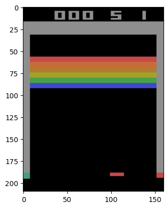
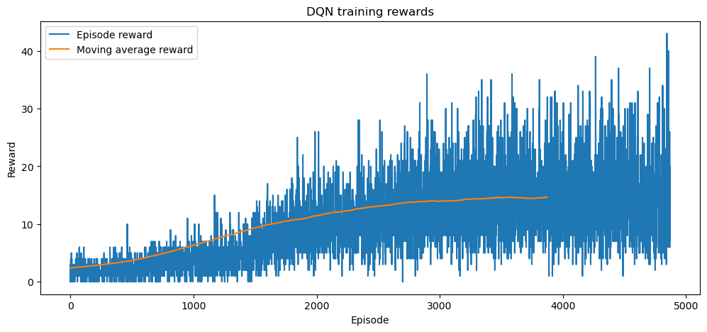
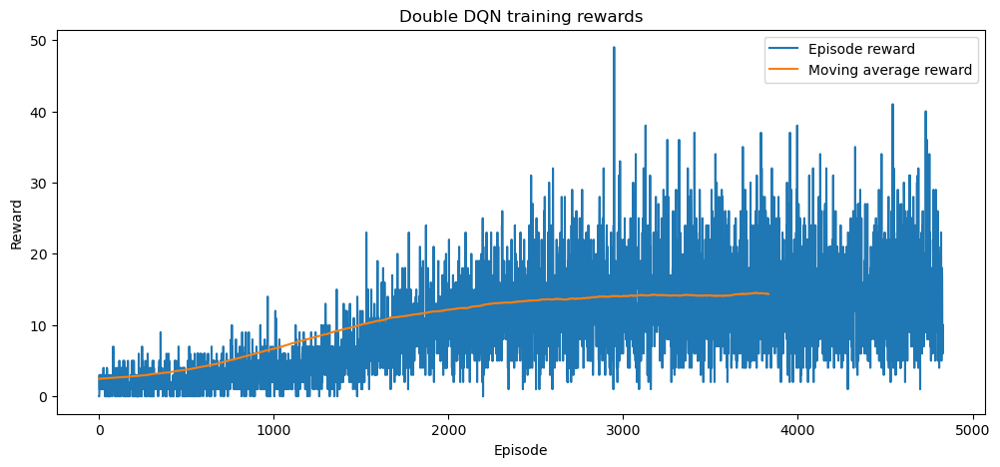
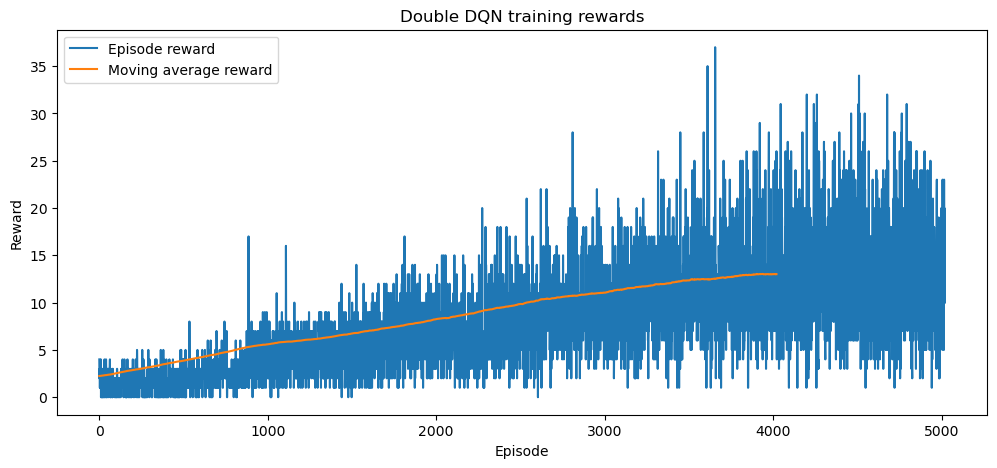

# 🧠 CS6482 Deep Reinforcement Learning Projects

**Author:** Hoang Tu Bui (24005665)  
**Course:** CS6482 – Deep Reinforcement Learning  
**Supervisor:** J.J. Collins  
**Program:** Masters in Artificial Intelligence and Machine Learning

---

## 📘 Projects Overview

This repository contains two major coursework projects for CS6482, focusing on deep learning and reinforcement learning methodologies.  

| Project | Title | Description |
|----------|--------|-------------|
| [A1](#-project-a1-hybrid-mobilenetv3) | **Hybrid MobileNetV3: Impact of Activation Tuning and Feature Extractions** | Exploring MobileNetV3 enhancements using hybrid feature extraction and activation tuning for satellite image classification. |
| [A2](#-project-a2-deep-q-learning-on-atari-breakout) | **Deep Q-Learning and Double DQN for Atari Breakout** | Implementing and comparing DQN and Double DQN agents in the Atari Breakout environment with additional RL optimizations. |

---

## 🧩 Project 1: MobileNetV3

📄 **[Read Full Report (PDF)](/a1/CS6482-Assign1-24005665-24089036.pdf)**  

### Overview

This project explores the architecture of **MobileNetV3**, applying it to the **EuroSAT-RGB** dataset for land cover classification.  
We test performance improvements through:

- **Hybrid feature extraction** (Sobel filters + HOG + CNN)
- **Activation tuning** (GELU, LeakyReLU, ELU, Hard ELU)

### Dataset: EuroSAT-RGB

- **27,000 RGB images** (64×64 pixels each) from 34 European countries  
- **10 classes:** Annual Crop, Forest, Highway, River, etc.  
- **Split:** 60% training, 20% validation, 20% test  


*Dataset distribution figures*


*Sample augmented data*

### Architecture

The implementation is based on **MobileNetV3-Large**, incorporating:
- **Depthwise separable convolutions**
- **Squeeze-and-Excitation attention blocks**
- **Hybrid feature fusion** of handcrafted and learned representations


*Architecture diagram*

### Results

| Model | Accuracy | Macro Avg (F1) | Notes |
|--------|-----------|----------------|-------|
| MobileNetV3 (Baseline) | **93.94%** | 0.94 | Strong baseline |
| Hybrid Model | 91.52% | 0.91 | Slightly lower but faster convergence |
| GELU Activation Variant | **95.00%** | 0.92 | Best performance overall |


*Learning curves*  


*Confusion matrix*  


### Conclusion

- **GELU** outperformed Hard-Swish in both accuracy and convergence rate.  
- The **hybrid model** offers better learning speed for large datasets.  
- Future improvements include advanced feature fusion and broader datasets.

---

## 🎮 Project 2: Deep Q-Learning on Atari Breakout

📄 **[Read Full Report](./a2/CS6482-Assign2-24005665.ipynb)**  

### Overview

This project implements and compares **Vanilla DQN** and **Double DQN** agents on the Atari **Breakout** environment, using **Gymnasium** and **PyTorch**.  
We explore:
- Stable training through Huber loss  
- Improved generalization using Double DQN  
- Optimization via **hyperparameter tuning** and **prioritized experience replay**

### Environment

🎮 **Game:** Breakout (Atari 2600)  
🎯 **Goal:** Use the paddle to bounce the ball and break bricks.  
🧩 **Actions:** `NOOP`, `FIRE`, `RIGHT`, `LEFT`  
🖼️ **Observation:** 210×160 RGB frames → preprocessed to 84×84 grayscale stacks of 4 frames  



### Implementation Highlights

- **Network Input:** 4 stacked grayscale frames  
- **Model:** 3 convolutional layers + 2 fully connected layers  
- **Loss Function:** Huber Loss  
- **Replay Buffer:** Experience replay with periodic target network sync  
- **Training Devices:** CUDA / CPU fallback  

*Network Architecture:*  
```
DQN(
  (network): Sequential(
    (0): Conv2d(4, 32, kernel_size=(8, 8), stride=(4, 4))
    (1): ReLU()
    (2): Conv2d(32, 64, kernel_size=(4, 4), stride=(2, 2))
    (3): ReLU()
    (4): Conv2d(64, 64, kernel_size=(3, 3), stride=(1, 1))
    (5): ReLU()
    (6): Flatten(start_dim=1, end_dim=-1)
    (7): Linear(in_features=3136, out_features=512, bias=True)
    (8): ReLU()
    (9): Linear(in_features=512, out_features=4, bias=True)
  )
)
```


### Results

#### Vanilla DQN
- Faster early learning but unstable Q-value estimates due to overestimation.  
- Achieved consistent improvement over episodes.



#### Double DQN
- More stable learning dynamics with reduced overestimation bias.  
- Slightly slower start, better long-term policy stability.



### Added Enhancements

#### 🔧 Hyperparameter Optimization  
Implemented BOHB-inspired tuning for batch size, γ, learning rate, and target update frequency.  
Resulted in smoother convergence and improved reward consistency.

#### 🧠 Prioritized Experience Replay  
Integrated **PER** (Schaul et al., 2015) for improved sampling efficiency, focusing on transitions with high TD-error.  
Enabled faster convergence in sparse-reward environments.



### Discussion

- **Vanilla DQN** excels in dense-reward tasks (e.g., Breakout).  
- **Double DQN** generalizes better for noisy/sparse-reward environments.  
- **Rainbow DQN** combines complementary enhancements (Double DQN + PER + Dueling + Multi-step + Noisy Nets) for superior stability and performance.

---

## 🧾 References

**Core Papers:**
- Mnih et al. (2015). *Human-level control through deep reinforcement learning.*  
- van Hasselt et al. (2016). *Deep Reinforcement Learning with Double Q-Learning.*  
- Hessel et al. (2017). *Rainbow: Combining Improvements in Deep Reinforcement Learning.*  
- Howard et al. (2019). *Searching for MobileNetV3.*  
- Helber et al. (2017). *EuroSAT: A Novel Dataset for Land Use and Land Cover Classification.*  

---

© 2025 Hoang Tu Bui — All rights reserved.
