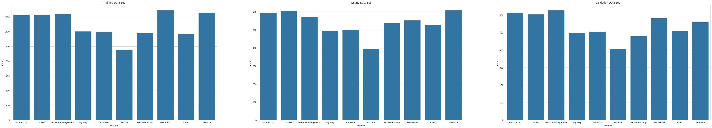
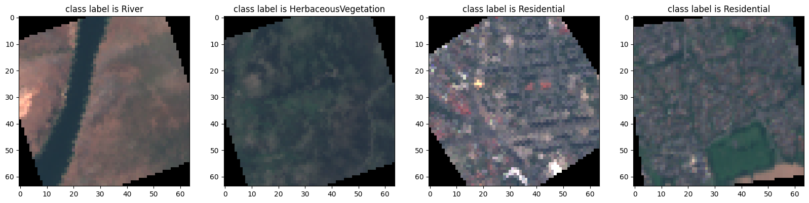
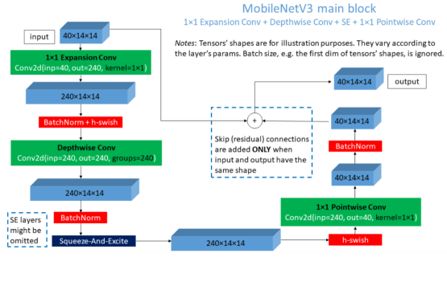
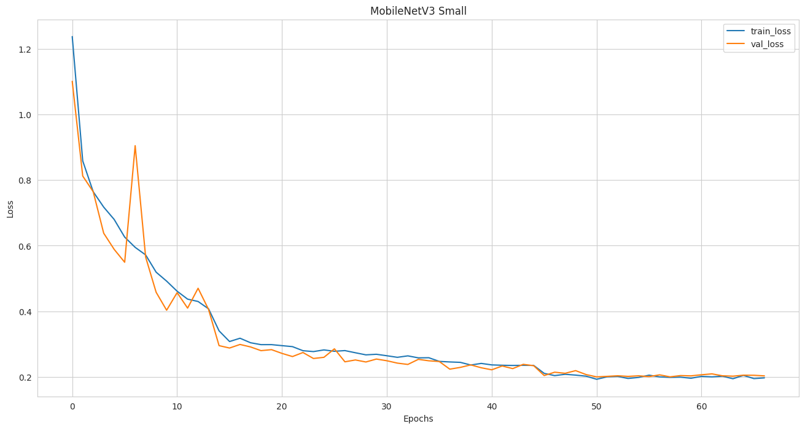
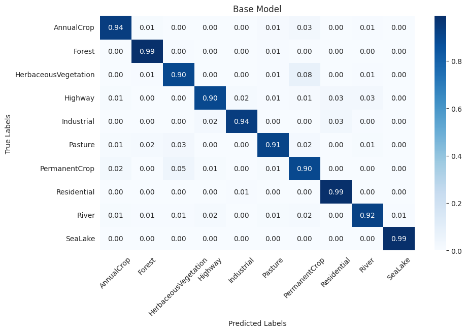

# Hybrid MobileNetV3: Impact of Activation Tuning and Feature Extractions

**Author:** Hoang Tu Bui (24005665)  
**Course:** CS6482 - Deep Reinforcement Learning  
**Supervisor:** J.J. Collins  
**Program:** Masters in Artificial Intelligence and Machine Learning (Semester 2)

---

📄 **[Read the Full PDF Report](a1/CS6482-Assign1-24005665-24089036.pdf)**

---

## 🧠 Overview

This project explores the architecture of **MobileNetV3**, a lightweight and efficient convolutional neural network, and its application to the **EuroSAT-RGB** satellite imagery dataset.  
We focus on understanding MobileNetV3’s efficiency and on enhancing it using:

- **Hybrid feature extraction** (combining traditional and deep features)  
- **Activation function tuning** (GELU, LeakyReLU, ELU, Hard ELU)

The hybrid model integrates **Sobel filtering** and **Histogram of Oriented Gradients (HOG)** features with deep representations to test whether handcrafted and learned features can complement each other.

---

## 🌍 Dataset: EuroSAT-RGB

The **EuroSAT dataset** contains **27,000 RGB satellite images** captured by the Sentinel-2 mission across 34 European countries.  
Each image has a resolution of **64×64 pixels** and belongs to one of ten classes:

> Annual Crop • Forest • Herbaceous Vegetation • Highway • Industrial Buildings • Pasture • Permanent Crop • Residential Buildings • River • Sea/Lake

### Data Distribution

- **Training set:** 16,200 images  
- **Validation set:** 5,400 images  
- **Test set:** 5,400 images  

Each subset maintains proportional representation across classes.

*Dataset distribution figures:*  

### Data Preprocessing & Augmentation

- Resizing all images to 64×64  
- Random horizontal/vertical flips  
- Random rotation (±45°)  
- Augmentations applied **only to training data**

*Sample augmented data:*  

---

## ⚙️ Model Architecture: MobileNetV3 and Variants

The project reviews and implements **MobileNetV1, V2, and V3**, focusing on their innovations:

- **MobileNetV1:** Depthwise separable convolutions  
- **MobileNetV2:** Inverted residuals and linear bottlenecks  
- **MobileNetV3:** Hard-Swish activation, SE attention blocks, and NAS-optimized structure  

*Architecture diagram:*  

### Hybrid Feature Integration

The hybrid version enhances MobileNetV3 by fusing:
- **SobelX/Y edge features**
- **HOG descriptors**
- **Deep features from CNN layers**

These are merged before the classification layer to improve generalization.

---

## 🧩 Training Setup

- **Loss function:** Cross-Entropy  
- **Optimizer:** Adam (LR = 0.001, reduced on plateau)  
- **Early stopping** and **learning rate scheduling** implemented  
- **Training duration:** Adaptive (based on early stopping)

*Learning curves*  

---

## 🧪 Evaluation

### Learning Curves

Hybrid models converge faster but achieve similar accuracy to the baseline MobileNetV3.  
Both maintain stable validation performance with minimal overfitting.

### Confusion Matrix

Models perform robustly across all 10 classes with balanced predictions.

*Confusion matrix*  

### Performance Metrics

| Model | Accuracy | Macro Avg (F1) | Weighted Avg (F1) |
|--------|-----------|----------------|-------------------|
| **Original MobileNetV3** | **93.94%** | 0.94 | 0.94 |
| **Hybrid Model** | 91.52% | 0.91 | 0.92 |

---

## 🔬 Activation Function Experiments

We replaced **Hard-Swish** with alternative activations to test convergence and accuracy:

| Activation | Accuracy | Training Time | Epochs | Observation |
|-------------|-----------|----------------|---------|--------------|
| **Hard-Swish (baseline)** | 93.94% | 8m36s | 67 | Stable baseline |
| **GELU** | **95.00%** | 12m43s | 98 | Best overall accuracy |
| **LeakyReLU** | 91.96% | 6m51s | 55 | Fast but lower accuracy |
| **ELU** | 93.69% | 7m29s | 59 | Fast convergence |
| **Hard ELU** | 93.15% | 8m04s | 67 | Moderate, no improvement |

---

## 🧾 Conclusion

- **GELU** outperformed other activations, providing the best balance between convergence and accuracy.  
- The **hybrid model** combining handcrafted and deep features performed competitively, especially in limited data or fast training scenarios.  
- The **classical MobileNetV3** remained slightly stronger in overall accuracy.  
- Future work: explore better feature fusion, more activation functions, and larger datasets.

---

## 📚 References

- Howard, A.G. et al. (2017). *MobileNets: Efficient Convolutional Neural Networks for Mobile Vision Applications.*  
- Sandler, M. et al. (2018). *MobileNetV2: Inverted Residuals and Linear Bottlenecks.*  
- Howard, A. et al. (2019). *Searching for MobileNetV3.*  
- Helber, P. et al. (2017). *EuroSAT: A Novel Dataset and Deep Learning Benchmark for Land Use and Land Cover Classification.*  
- Castro, C. (2015). *Approximation of Exp(x) Deduced from the Implicit Euler Numerical Solution of First Order Linear Differential Equations.*  
  [View on Semantic Scholar](https://www.semanticscholar.org/paper/Approximation-of-Exp%28x%29-Deduced-from-the-Implicit-Castro/a8f379a98998501e3b32ea94e5fb85a7a9c1e6b1)

---

🖇️ **Full Report:**  
👉 [Download the complete PDF report](a1/CS6482-Assign1-24005665-24089036.pdf)

---

© 2025 Hoang Tu Bui — All rights reserved.
